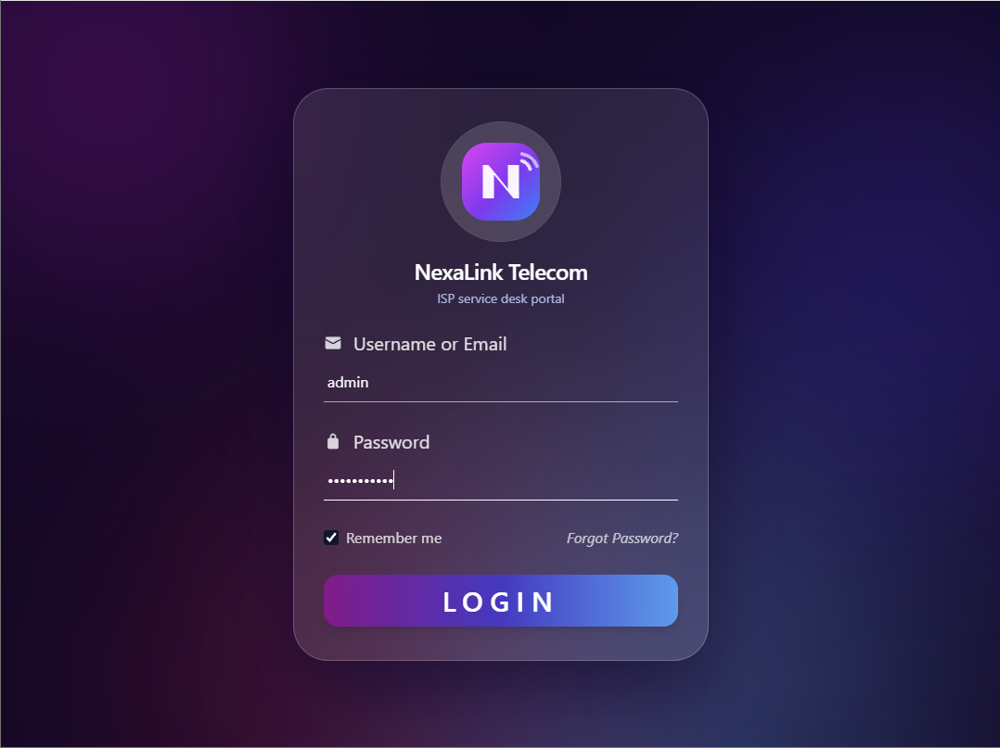
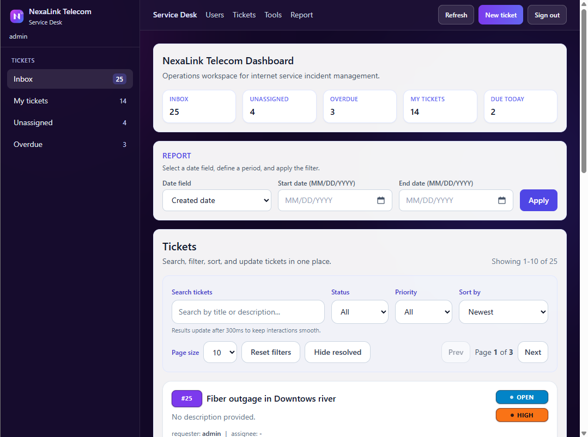
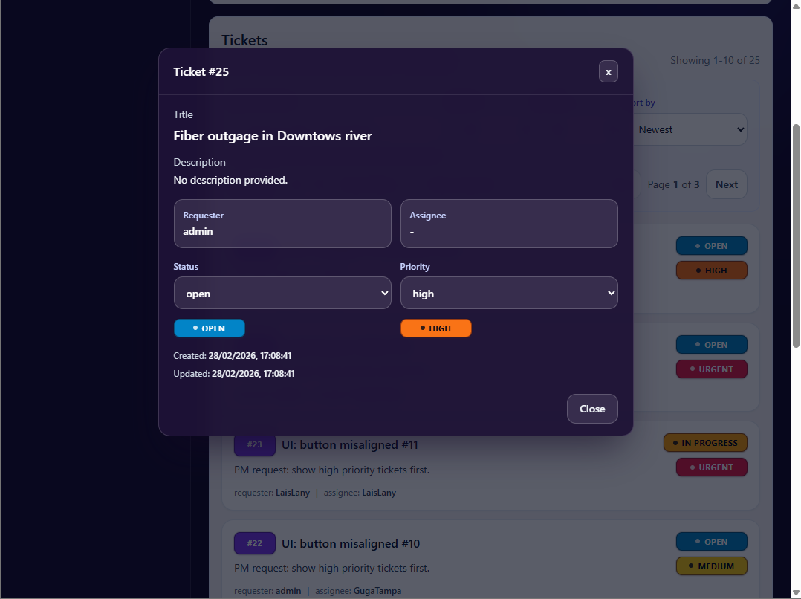

# NexaLink Telecom Service Desk

[](https://github.com/GugaValenca/ticketing-portal/actions/workflows/ci.yml)


A full-stack service desk platform for an internet provider workflow, built with Django REST Framework and React (Vite).
It combines authentication, role-aware ticket access, and a practical UI for tracking internet service incidents.

## Live Demo

- **Main Demo:** https://ticketing-portal-web.vercel.app/
- **API:** https://ticketing-portal-api.vercel.app/
- **API Docs (Swagger):** https://ticketing-portal-api.vercel.app/api/docs/
- **OpenAPI Schema:** https://ticketing-portal-api.vercel.app/api/schema/
- **Repository:** https://github.com/GugaValenca/ticketing-portal

## Overview

NexaLink Telecom Service Desk is a job-ready portfolio project designed to simulate real ISP support operations:

- A React + TypeScript frontend with filtering, sorting, and pagination UX
- A Django REST API with JWT authentication and permission-aware access rules
- Production deployment on Vercel for frontend and backend
- Docker-based local setup for backend and PostgreSQL

The public demo is focused on the main user workflow. Administrative tools are reserved for internal management and development use.

## Features

- JWT authentication delivered as httpOnly cookies (not readable by page JavaScript), with CSRF protection on state-changing requests
- Login support using username or email
- Automatic token refresh using Axios interceptors
- Rate limiting on login and token refresh to slow down credential brute-forcing
- Role-aware ticket access for requester, assignee, and staff/superuser rules
- Ticket CRUD via DRF ModelViewSet
- Status updates in the ticket details flow
- Priority managed by administrators via Django admin
- Debounced search, status/priority filters, sorting, and pagination
- API documentation with drf-spectacular (Swagger/OpenAPI)
- Seed command for development/demo dataset creation

## Screenshots

### Login


### Dashboard


### Ticket Details


## Installation

1. Clone the repository:

```bash
git clone https://github.com/GugaValenca/ticketing-portal.git
cd ticketing-portal
```

2. Backend setup:

```bash
cd backend
python -m venv .venv
```

Windows:

```bash
.venv\Scripts\activate
```

macOS/Linux:

```bash
source .venv/bin/activate
```

Install backend dependencies:

```bash
pip install -r requirements.txt
```

Copy the env template and adjust if needed (the defaults already work for local dev):

```bash
cp .env.example .env
```

3. Frontend setup:

```bash
cd ../frontend
npm install
cp .env.example .env
```

## Usage

### Public Demo Flow

1. Open the main demo URL
2. Sign in with the demo account (see below)
3. Create, filter, and update tickets to evaluate the full workflow

### Demo Access

The public demo doesn't ship with a fixed password - credentials are generated
per environment instead of being hardcoded in source. To get a login for your
own local instance, run the seed command below and use one of the printed
accounts (`admin`, `LaisLany`, or `demo_agent`).

### Local Development

Both the frontend and backend need to run on `localhost` (not `127.0.0.1`)
for the JWT auth cookies to work - they're same-site on `localhost` regardless
of port, but treated as different sites otherwise.

Option A: Docker backend + PostgreSQL

```bash
docker compose up --build
```

Option B: run backend and frontend separately

Backend:

```bash
cd backend
python manage.py migrate
python manage.py seed   # optional: creates demo users + sample tickets
python manage.py runserver localhost:8001
```

Frontend:

```bash
cd frontend
npm run dev
```

## Testing

Backend (Django test runner; `settings_test` swaps in a fast password
hasher so the suite runs in under a second instead of ~30s):

```bash
cd backend
python manage.py test --settings=config.settings_test
```

Frontend unit tests (Vitest):

```bash
cd frontend
npm run test
```

End-to-end test (Playwright - covers the critical path: log in, create a
ticket, see it in the list, sign out). Boots its own frontend/backend dev
servers against a disposable `backend/e2e.sqlite3` database, so nothing
else needs to be running first:

```bash
cd frontend
npx playwright install chromium   # first run only
npm run test:e2e
```

## Linting & Formatting

Backend (black, isort, ruff - ruff and isort read `ruff.toml` /
`.isort.cfg`; black's flags are passed directly since a `pyproject.toml`
here would make Vercel's Python builder switch to uv-based builds):

```bash
cd backend
pip install -r requirements-dev.txt
black --line-length 100 --extend-exclude '/migrations/' .
isort .
ruff check .
```

Frontend (eslint):

```bash
cd frontend
npm run lint
```

## Environment Variables

Both apps read config from `.env` locally (see `.env.example` in each
folder) and from real environment variables in production (Vercel project
settings, or `docker-compose.yml` for the Docker backend).

**Backend** (`backend/.env`):

| Variable | Required in production | Default |
| --- | --- | --- |
| `DJANGO_SECRET_KEY` | Yes | insecure local-only fallback |
| `DEBUG` | No | `False` |
| `ALLOWED_HOSTS` | Yes | `127.0.0.1,localhost,.vercel.app` |
| `DATABASE_URL` | Yes (Postgres) | falls back to local SQLite if unset |
| `CORS_ALLOWED_ORIGINS` | Yes | localhost + the deployed frontend origin |
| `CSRF_TRUSTED_ORIGINS` | Yes | `http://localhost:5173`, `http://127.0.0.1:5173` |
| `AUTH_COOKIE_SECURE` | No | `True` unless `DEBUG` is set |
| `AUTH_COOKIE_SAMESITE` | No | `None` in production, `Lax` in dev |

**Frontend** (`frontend/.env`):

| Variable | Required | Default |
| --- | --- | --- |
| `VITE_API_BASE_URL` | No | the deployed API URL in production builds, `http://localhost:8001` in dev |

## Project Structure

```bash
ticketing-portal/
|-- backend/
|   |-- api/
|   |   |-- index.py
|   |-- config/
|   |   |-- settings.py
|   |   |-- urls.py
|   |-- tickets/
|   |   |-- management/commands/seed.py
|   |   |-- auth.py
|   |   |-- models.py
|   |   |-- serializers.py
|   |   |-- permissions.py
|   |   |-- views.py
|   |   |-- me.py
|   |   |-- admin.py
|   |-- requirements.txt
|   |-- vercel.json
|-- frontend/
|   |-- src/
|   |   |-- components/
|   |   |-- lib/api.ts
|   |   |-- App.tsx
|   |   |-- main.tsx
|   |-- package.json
|   |-- vercel.json
|-- docker-compose.yml
|-- README.md
```

## Key Technical Highlights / What I Learned

- Implementing end-to-end JWT auth as httpOnly cookies, with CSRF protection and automatic refresh handling
- Building practical permission logic for role-aware access in DRF
- Connecting frontend UX state to secure backend flows with resilient API handling
- Structuring Vercel deployment for a monorepo with separate frontend/backend apps
- Improving backend performance with query optimization (`select_related`)

## Technologies Used

- **Frontend:** React 19, TypeScript, Vite, Axios, Tailwind CSS
- **Backend:** Python 3.12+, Django 6, Django REST Framework, SimpleJWT, drf-spectacular
- **Database:** PostgreSQL (production/Docker), SQLite (local fallback)
- **Testing:** Vitest
- **Deployment:** Vercel
- **Containerization:** Docker, Docker Compose
- **Package Managers:** npm (frontend), pip (backend)

## Future Improvements

- Expand ticket assignment and workflow controls in the UI
- Add richer audit history for key ticket updates
- Improve observability for API and frontend runtime errors
- Broaden e2e coverage beyond the single critical-path test

## Contributing

1. Fork the project
2. Create your feature branch (`git checkout -b feature/AmazingFeature`)
3. Commit your changes (`git commit -m "Add some AmazingFeature"`)
4. Push to the branch (`git push origin feature/AmazingFeature`)
5. Open a Pull Request

## License

This project is licensed under the MIT License.

## Contact

**Gustavo Valenca**

[](https://github.com/GugaValenca)
[](https://www.linkedin.com/in/gugavalenca/)
[](https://www.instagram.com/gugatampa)
[](https://www.twitch.tv/gugatampa)
[](https://discord.com/invite/3QQyR5whBZ)

---

If you found this project helpful, please give it a star.
